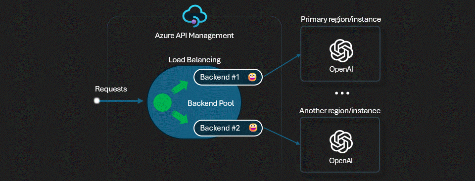

# APIM ❤️ AI Foundry

## [Multi-Model Failover lab](multi-model-failover.ipynb)

[](multi-model-failover.ipynb)

This lab demonstrates how to implement automatic failover between different AI models when the primary model is unavailable or throttled. It combines multiple APIM patterns into a production-ready architecture:

- **Priority-based routing** with a backend pool across three AI models (gpt-4.1-nano → gpt-5.2 → gpt-4.1)
- **Retry policy** with exponential backoff for transient failures (429/503)
- **Circuit breaker pattern** to temporarily remove unhealthy backends from the pool
- **Built-in LLM logging** to track token usage across all backends
- **FinOps framework** with per-product token rate limiting, cost tracking via Azure Monitor, and automated quota controls
- **Microsoft Agent Framework (MAF)** agent testing through the APIM gateway
- **Three APIM products** (Finance, Marketing, HR) with dedicated subscriptions and per-product rate limits

### Architecture

| Component | Details |
|-----------|---------|
| **Backends** | 2 AI Foundry services — PTU (priority 1) + PayGo spillover (priority 2) — with identical deployment names |
| **Load Balancing** | Backend pool with priority-based routing; PTU capacity exhausted → circuit breaks → PayGo absorbs overflow |
| **Products** | Finance (2000 TPM), Marketing (1000 TPM), HR (500 TPM) |
| **Failover** | Retry policy (2 retries on 429/503) + circuit breaker (1 failure, 1min trip) |
| **Monitoring** | App Insights + Log Analytics + token metrics emission per product |
| **FinOps** | Cost quotas per product, Logic App for automated subscription suspend/activate |
| **Existing Resources** | Only APIM must exist; Bicep creates Log Analytics, App Insights, Foundry accounts/projects/model deployments, and APIM configuration |

### Load Testing & Scenario Verification

The lab includes scripts to generate load and verify the AI Gateway scenarios end-to-end.

**Load Test** (`load-test.py`):

```bash
# Standard mode — balanced load across all products
python3 load-test.py --runs 90 --concurrency 10

# Quota mode — hit per-product TPM limits to demonstrate 429 enforcement
python3 load-test.py --mode quota --concurrency 5
```

**Scenario Verification** (`verify-scenarios.py`):

```bash
python3 verify-scenarios.py --timespan PT1H
```

**Telemetry Query** (`multi-model-test-query.py`):

```bash
python3.12 multi-model-test-query.py
```

Queries Log Analytics and generates `scenario-report.md` with charts covering 5 scenarios:

| # | Scenario | What it verifies |
|---|----------|-----------------|
| 1 | Load Balancing | Backend failover from foundry1 → foundry2 on 429s |
| 2 | Department Access | All 3 products (subscriptions) can access the API |
| 3 | Usage Monitoring | Token usage tracked per product, model, and over time |
| 4 | Cost Monitoring | Estimated costs per product/model vs configured quotas |
| 5 | Quota Enforcement | Per-product TPM limits trigger 429 when exceeded |

### Prerequisites

- [Python 3.12 or later version](https://www.python.org/) installed
- [VS Code](https://code.visualstudio.com/) installed with the [Jupyter notebook extension](https://marketplace.visualstudio.com/items?itemName=ms-toolsai.jupyter) enabled
- [Python environment](https://code.visualstudio.com/docs/python/environments#_creating-environments) with the [requirements.txt](../../requirements.txt) or run `pip install -r requirements.txt` in your terminal
- [An Azure Subscription](https://azure.microsoft.com/free/) with [Contributor](https://learn.microsoft.com/en-us/azure/role-based-access-control/built-in-roles/privileged#contributor) + [RBAC Administrator](https://learn.microsoft.com/en-us/azure/role-based-access-control/built-in-roles/privileged#role-based-access-control-administrator) or [Owner](https://learn.microsoft.com/en-us/azure/role-based-access-control/built-in-roles/privileged#owner) roles
- [Azure CLI](https://learn.microsoft.com/cli/azure/install-azure-cli) installed and [Signed into your Azure subscription](https://learn.microsoft.com/cli/azure/authenticate-azure-cli-interactively)
- Existing Azure API Management instance with system-assigned managed identity enabled

### Deploy with Bicep

The deployment expects only APIM to already exist. Bicep creates Log Analytics, Application Insights, AI Foundry accounts/projects/model deployments, APIM backends, backend pool, API policies, diagnostics, products, subscriptions, and FinOps resources.

1. Enable APIM managed identity if needed:

```bash
az apim update \
  --name <existing-apim-name> \
  --resource-group <resource-group> \
  --set identity.type=SystemAssigned
```

2. Deploy the lab:

```bash
az deployment group create \
  --resource-group <resource-group> \
  --template-file main.bicep \
  --parameters apimName=<existing-apim-name>
```

3. Optional: customize `params.json` before deployment to change regions, Foundry names, models, products, TPM limits, and cost quotas:

```bash
az deployment group create \
  --resource-group <resource-group> \
  --template-file main.bicep \
  --parameters @params.json apimName=<existing-apim-name>
```

For PTU/PayGo spillover, use identical model deployment names on both Foundry accounts. Configure the PTU Foundry with `priority: 1` and the PayGo Foundry with `priority: 2`.

### Resource naming

By default, created Azure resources use this naming convention:

```text
<resource abbreviation>-<projectName>-<subprojectName>-<number>-<tenantName>
```

The default naming parameters are:

| Parameter | Default |
|-----------|---------|
| `projectName` | `ict-apim` |
| `subprojectName` | `multi-model-failover` |
| `dcrSubprojectName` | `mf` |
| `resourceNumber` | `001` |
| `secondaryResourceNumber` | `002` |
| `tenantName` | `mpsvcrtest` |

Default names:

| Resource | Default name |
|----------|--------------|
| Log Analytics | `log-ict-apim-multi-model-failover-001-mpsvcrtest` |
| Application Insights | `appi-ict-apim-multi-model-failover-001-mpsvcrtest` |
| Foundry account 1 | `aif-ict-apim-multi-model-failover-001-mpsvcrtest` |
| Foundry account 2 | `aif-ict-apim-multi-model-failover-002-mpsvcrtest` |
| Foundry project 1 | `proj-ict-apim-multi-model-failover-001-mpsvcrtest` |
| Foundry project 2 | `proj-ict-apim-multi-model-failover-002-mpsvcrtest` |
| Pricing DCR | `dcr-ict-apim-mf-001-mpsvcrtest` |
| Subscription quota DCR | `dcr-ict-apim-mf-002-mpsvcrtest` |
| Logic App | `logic-ict-apim-multi-model-failover-001-mpsvcrtest` |
| Action group | `ag-ict-apim-multi-model-failover-001-mpsvcrtest` |
| Suspend subscription alert | `alert-ict-apim-multi-model-failover-001-mpsvcrtest` |
| Activate subscription alert | `alert-ict-apim-multi-model-failover-002-mpsvcrtest` |
| APIM backend IDs | `foundry1`, `foundry2` |

To use your own names, set the naming parameters in `params.json` or `params.json.example`:

```json
{
  "parameters": {
    "projectName": {
      "value": "ict-apim"
    },
    "subprojectName": {
      "value": "multi-model-failover"
    },
    "dcrSubprojectName": {
      "value": "mf"
    },
    "resourceNumber": {
      "value": "001"
    },
    "secondaryResourceNumber": {
      "value": "002"
    },
    "tenantName": {
      "value": "mpsvcrtest"
    },
    "aiServicesConfig": {
      "value": [
        {
          "name": "foundry1",
          "location": "swedencentral",
          "priority": 1,
          "resourceNumber": "001"
        },
        {
          "name": "foundry2",
          "location": "eastus2",
          "priority": 2,
          "resourceNumber": "002"
        }
      ]
    }
  }
}
```

`name` is the logical APIM backend ID and must match `modelsConfig[*].aiservice`; optional `resourceName` can still override the actual Azure AI Foundry account name.

### 🚀 Get started

Proceed by opening the [Jupyter notebook](multi-model-failover.ipynb), and follow the steps provided.

### 🗑️ Clean up resources

When you're finished with the lab, you should remove all your deployed resources from Azure to avoid extra charges and keep your Azure subscription uncluttered.
Use the [clean-up-resources notebook](clean-up-resources.ipynb) for that.
